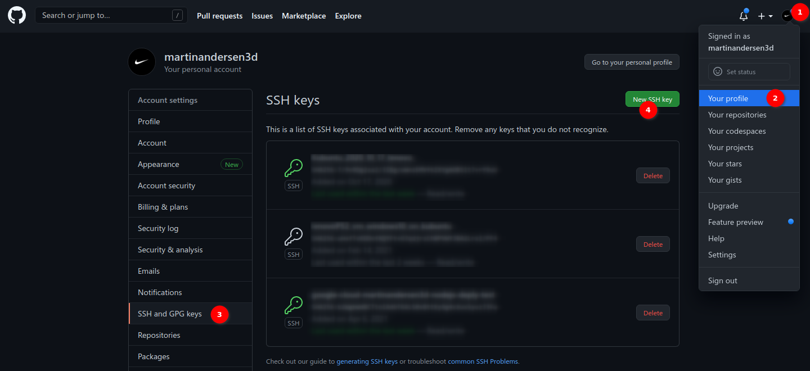
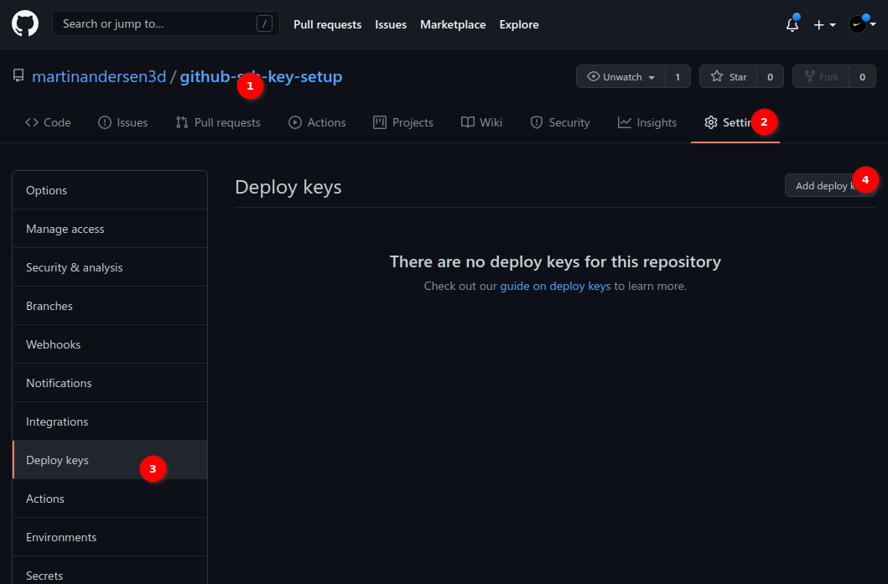
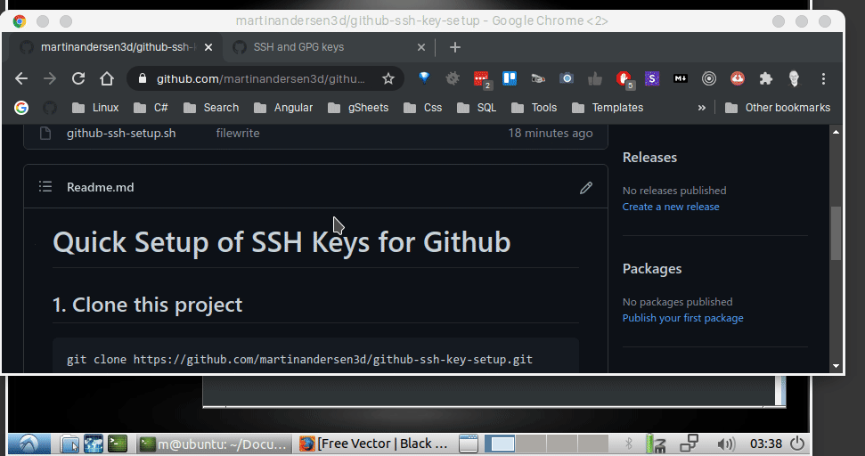
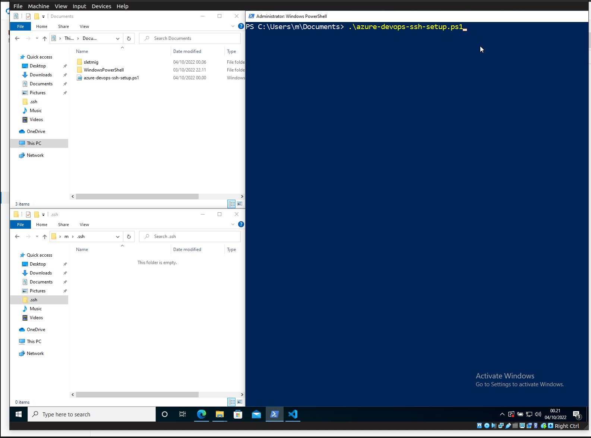

# Quick Setup of SSH Keys for Github And Azure

# Github SSH Setup:

This sccript is in two versions:
- **Linux:** github-ssh-setup.sh
- **Windows+Git Bash:** github-ssh-setup_OS_WINDOWS.sh

## 1. Clone this project
```
git clone https://github.com/martinandersen3d/github-ssh-key-setup.git
```
## 2. Run the script
```
cd github-ssh-key-setup/
./github-ssh-setup.sh
```
# Step 3, has two options:
### 3A. Add Keys on your Profile (Computer will have access to ALL your repositories):
Use this option if your are settings up your developer computer.

https://github.com/settings/keys 




### 3B. Add Keys on a git repository (Computer will have access ONLY on the repositories, where you add the key):
Use this option if your have a server, that needs access to ONE or more private/public repositories.
1. Go to the repository you want the server to access.
2. Go into repository > Settings
3. Deploy keys 
4. Add Deploy key




## Demonstration


# Azure Devops SSH Setup:

Todo:
- Currently it overwrites the file in c:\users\\$USER\\.ssh\config, if you have any data there, make a backup before you run the script
- Replace all github descriptions with Azure Devops descriptions

## Demonstration - Azure


Note: For some stupid reason Microsoft needs TWO domains to make the SSH work for Azure, and not one domain like everyone else.

Example of config file:
C:\Users\MyUsername\.ssh\config
```
Host ssh.dev.azure.com
   PubkeyAcceptedKeyTypes=ssh-rsa
   HostName ssh.dev.azure.com
   IdentityFile C:\Users\MyUsername\.ssh\azure_rsa
   IdentitiesOnly yes
   AddKeysToAgent yes
   PasswordAuthentication=no
   User git

Host vs-ssh.visualstudio.com
  IdentityFile C:\Users\MyUsername\.ssh\azure_rsa
  IdentitiesOnly yes
```


